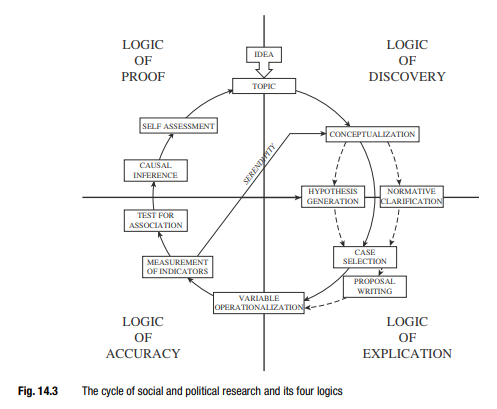
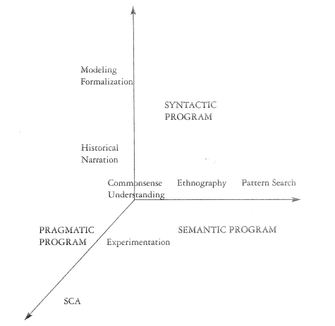

# Anotações úteis das aulas de FLS 5028  - Métodos Quanti

## Sumário

- [Aula 3 - Aplicações de desenhos de pesquisa: Experimento vs. Observacional](#aula-3---aplicações-de-desenhos-de-pesquisa-experimento-vs-observacional)
- [Aula 6 - Amostragem](#aula-6---amostragem)
- [Aula 7 - Estatística Descritiva](#aula-7---estatística-descritiva)

## Aula 3 - Aplicações de desenhos de pesquisa: Experimento vs. Observacional

Date: 04/06/2022

Aula 3 - causalidade, experimentos e observação

Tópicos metateóricos que fundamentam a pesquisa empírica hoje em dia - aula anterior

A cp tem a pretensão de identificar relações de causalidade - explicar por meio de técnicas experimentais e observacionais

Diferentes noções de causalidade

Os métodos da CS buscam diferentes formas de explicar fenômenos. Formas diferentes de explicação: pragmática

1. pragmática - explicação que permite intervenção - funciona quando há uma causa necessária para que algo aconteça
2. semântica - traduz-se uma explicação de forma que se pare de procurar por respostas - encontra-se uma afirmação satisfatória - tradução de um fenômeno até que estejamos intuitivamente satisfeitos
3. Sintática - uma explicação é satisfatória simplesmente porque é elegante e logicamente simples de forma convincente - tem a ver com a formalização matemática

Existem diversos métodos diferentes para produzir cada explicação, método como técnica de capturar informações do mundo e interpretá-lo. O autor traça 5 tipos ideais, que se conectam com as discussões ontológicas e epistemológicas da aula passada, ou seja, que tipo de dado se quer produzir, se quer se entender algo muito subjetivo ou menos, e que tipo de explicação se busca (camada adicionada nessa aula), além de qual a noção de causalidade.

1. etnografia
2. narrativa histórica
3. análise causal padrão
4. comparação com n-pequeno
5. formalização - não depende de dados, é a criação de um modelo matemático que represente uma teoria, e que será testado posteriormente, é dedutivo

No fundo, toda pesquisa compara casos, e cada um desses métodos tem uma forma de comparar dependendo se for um n-grande ou n-pequeno.

Gráfico Abbott, 2004, p. 29 - são outra dimensão para escolher o tipo da técnica a ser usada no seu trabalho

Como definir causalidade?

X->Y um modelo ou teoria que afirme isso

Existem muitos modos de pensar causalidade - que nos levam a procedimentos metodológicos diferentes. Causalidade lida com condições necessárias E suficientes para que determinado evento aconteça, o que pode estar ou não explícito na técnica escolhida - Inus condition - texto que fala mais disso,

Brady, 2008, p. 219 - noção metodológica que tem 4 tipos ideais a depender da noção de causalidade.

1. regularidade: X->Y se repete sempre, é na repetição por várias vezes, na simetria (ou seja X causa Y, que há a causalidade. No aspecto assimétrico (por que Y não causa X), X deve necessariamente ocorrer primeiro, não identifica no entanto, conexões suficientes, não se investiga condições de suficiência, isto é, outras causas que possam estar envolvidas, apenas conexões necessárias.
2. contrafactual: X->Y por abstração, raciocinar contra o fato ocorrido, verdade em um mundo similar, imaginar e considerar o contrário, e se X não causar Y? E se não houver X? Você demonstra por abstração que “se não tivesse ocorrido X então Y não ocorreria”. Ele hoje em dia está presente em todos, virou uma maneira “padrão” de se apresentar explicações.
3. manipulação: experimento, manipulo X para avaliar se ocorre Y. Noção do senso comum de como a ciência funciona. Consigo controlar o X. O grupo de tratamento e de controle precisa ser igual na média. O pesquisador precisa conseguir atribuir o tratamento aleatoriamente. Os indivíduos não podem decidir se vão receber o tratamento ou não. Deve haver um critério de comparabilidade entre o grupo de controle e o de tratamento.
4. mecanismos: não avalio que X->Y mas sou capaz de mostrar como. O foco está na seta entre X e Y. De que maneira estão associados? O”como” não fica só no capítulo teórico, ele é o foco da pesquisa. O campo geralmente já confirmou X->Y e então o campo se orientam a este tipo de pesquisa. Apresentar a maneira como os eventos se conectam entre a causa e o efeito.

Causa dos efeitos - busco identificar a causa de um fenômeno escolhido, exemplo “por que o ônibus atrasa?” A minha pergunta olha para o que causa um objeto/fenômeno/evento.

Efeitos da causa - busco identificar o efeito de uma causa, “qual o impacto da chuva no ônibus?". A minha pergunta olha para os efeitos de uma causa. Exemplo, dou um remédio e vejo o que o remédio causou.

Schmitter, 2008, p.264 - as possibilidades e escolhas metodológicas dependem da maturidade do campo.

Experimentos VS observações

Como definir que X->Y? Há variáveis confundidoras (Z). Se há um Z -> Y até q não tem problema, porque meu foco é X->Y. O problema é, por exemplo, Z->X e Z tb ->Y. Aí ela é confundidora. O fato de  Z afetar X e Y cria uma situação em que não tenho como saber se X->Y se a seta aqui existe.

Para isolar Z, num experimento o X (tratamento) é manipulado. Com dados observacionais, não há como manipular X e portanto Zs não são controláveis. O tratamento não é aleatoriamente atribuído. Não há nenhuma característica intrínseca das observações receberem ou não o tratamento. Se todos têm chances iguais de receberem ou não o tratamento, então só X pode ter causado. Quasi-experimento - as unidades se auto selecionaram.

Com dados observacionais existem possibilidades de técnicas de simular ou emular experimentos, mas é necessário encontrar situações e dados suficientes.

## Aula 6 - Amostragem

Date: 05/04/2022

Amostragem diz respeito a como foi medida a variável.
Em qual unidade os dados foram medidos com a intenção de que eles representem um conjunto de fenomenos mais amplo.
em qual unidade foram medidos e se de fato representam o conceito que se pretende medir e dizem respeito ao geral?

ex eleitores - pop / pesquisa de intenção de voto com uma certa amostra, diz respeito a toda pop de eleitores? o conjunto de quem eu ouvi a intenção é representativo da pop? Isso porque quero que represente o conjunto maior - **PROCESSO DE INFERÊNCIA**

**INFERÊNCIA** -> processo de conhecer alguma informação e a partir dela extrapolar para conjuntos de outras unidades similares que não se conhece
Conkunto mais amplo de elementos aos quais serão atribuidos comportamentos a partir de uma parcela desses elementos.
Inferindo que os elementos que não vi tem as mesmas características/comportamento dos elementos que eu vi
A representatividade diz respeito a se essas unidades que estou olhando podem me dar informações sobre a pop.

O processo de amostragem gera viés. É ele que garante que a amostra será representatitva. Ex: dizem que amostras representantitvas precisam ter quantidades proporcionais de homens, mulheres, negros etc.. essa afirmação tem como pressuposto que essas variáveis (genero, raça, renda...) influenciarão e importarão para o voto. São parâmetros que a priori o pesquisador está pressupondo que terão influência na pesquisa.

Amostragem aleatória não assume nada a priori, não carrega nenhum pressuposto sobre as unidades -> selecionando elementos da pop de maneira aleatória pode-se identificar comportamentos das unidades com base nas variáveis que no parágrafo acima já estavam sendo colocadas como a priori sendo significativas.

A amostragem aleatória é independente de qualquer base teórica específica, e pode ser usada para testar essas hipóteses (ex homens votam dif de mulheres

> Os parâmetros são atributos teóricos associados à população de interesse e precisam ser operacionalizados em variáveis.
>

### Def de amostragem

Processo de seleção de elementos de uma pop a fim de fazer uma inferência
A cada novo elemento da amostra, a diferença começa a ser desprezível, cada elemento novo trás cada vez menos informação (ouvir 1 eleitor entre 1000 só muda 0,1%, e vai diminuindo cada vez mais. Isso na estatística faz com que a partir de certo ponto não precisamos mais, no exemplo, entrevistar mais ninguém. EM outras palavras qual o N que produz uma magem de erro de 2%, ou qual o N em que a diferença entre a estimativa e a amostra tenda a 0%, se eu ouvir mais a margem de erro diminui para 1%, e pra 0,5% e etc...

Amostragem é feita quando por algum motivo é impossível conhecer a pop inteira OU se queremos encontrar resultados que digam respeito a situações ainda não ocorridas.

O parâmetro de uma pop é atributo que queremos conehcer, relacionado ao conceito que eu operacionalizei.

Existe diferenças quando tenho dados que são considerados uma amostra e quando tenho dados que são considerados uma pop. Mesmo que eu tenha dados por exemplo de todos os deputados, não trato como pop, porque quero que minha teoria seja válida de forma GERAL, quero testar se X->Y no futuro, em outros países, etc. A lógica inferencial vem do objetivo de querer se referir a uma relação que extrapola aquele conjunto específico. Se quer-se generalizar relações causais, se este é o uso dos dados que quero fazer, então deve-se tratar como amostra, mesmo descrições que estejam se relacionando com relações causais precisam partir deste princípio.

> A boa amostra permite a generalização de seus resultados dentro de limites aceitáveis de dúvidas” (Bolfarin e Bussab, p. 14)
>

Toda pesquisa empírica o pesquisador precisa saber determinar QUAL É A UNIDADE DE ANÁLISE. A unidade de análise é a linha num banco de dados.

Um Estrato é qualquer subdivisão para o qual se busca produzir uma inf mais específica, exemplo dividir por renda, idade, sexo, país, são estratificação. Uma vez estratificadas, cada categoria tem que ser mutuamente exclusivas (uma unidade é classificada de um jeito e apenas um jeito) coletivamente exaustivas (todas unidades devem ser classificadas de pelo menos um jeito, em outras palavras, nenhuma unidade deve ficar de fora e não pode ficar em mais de uma categoria.

Para que se estratifica = ao final da pesquisa pode-se falar sobre esses estratos, em algumas pesquisas usa-se isso para avaliar a qualidade da amostra produzida.

Quando eu coleto uma amostra existe uma margem de dúvida sobre aquela amostra. A diferença entre o que eu vejo na amostra e o verdadeiro valor da pop é o ERRO AMOSTRAL.

O processo amostral tem que ser aleatório = todas as unidades que compõem a pop tem que ter a mesma chance de serem selecionadas

O raciocínio é sempre o de que a pop é grande o suficiente para que seja considerada como infinita, e sempre o processo amostral será estimado com reposição (veremos na aula de probabilidade). Se sua amostra não é aleatória ela potencialmente tem viés, então é necessário saber a que ela se refere, não que ela seja inútil, mas ela tem limites sobre até onde pode ser generalizada, para qual pop seus resultados podem ser extrapolados.

### SLIDE TIPOS DE AMOSTRAGEM

> Tipos de amostragem: Amostragem aleatória simples de n elementos de uma população é aquela na qual cada amostra possível daquele tamanho tem a mesma probabilidade de ser selecionada. Neste caso, cada membro da população tem a mesma chance de ser selecionado;
Amostragem estratificada é utilizada quando se deseja comparar grupos dentro de uma população. Neste caso, são selecionados aleatoriamente membros de cada estrato. Ex.: grupos étnicos;
Amostragem por cluster ocorre com a população dividida em grandes números de grupos, chamados clusters, no qual a amostragem aleatória é feita nestes grandes grupos. Ex.: sortear quarteirões e entrevistar todas as pessoas destes quarteirões.
Amostragem não aleatória Ex.: formada por voluntários"
>

A amostragem aleatória simples é um tanto impraticável, tanto por recursos.
Na estratificiada o N começa a variar dentro de cada cota. Ex tenho que ouvir pelo menos 200 pessoas de cada religião, mesmo que o N de cada cota vai variar. A estratificação é feita porque é uma categoria com a qual quero olhar algum fenomeno. Aleatorizo dentro de cada estrato. Sorteio aleaotiramente dentro de cada grupo, independente do N (pop).

Amostragem por cluster a separação é regional (ex quarteirões). Ex sorteio primeiro os estados proporcionalmente ao tamanho de pessoas que tem em cada estado; depois sorteio em vários níveis, em municipios, bairros, aí as 1000 pessoas de cada bairro são sorteadas dentro de estratos, exemplo os distritos censitários do IBGE.

Amostras não aleatórias podem ser feitas a depender da pergunta de pesquisa, exemplo pesquisas que não vão fazer inferências para generalizações.

### DIFICULDADES NO PROCESSO DE AMOSTRAGEM

#### 1o compnenete = erro amostral

> Erro amostral é o erro que ocorre em uma estatística baseada em uma amostra estima ou prevê o valor de um parâmetro populacional. Quanto maior a amostra, menor o erro amostral.
>

Sabemos que ele sempre existirá e sabemos lidar com ele, não é um erro do processo de amostragem, é natural que ocorra porque amostras variam - a medida que o n cresce vai diminuir o erro amostral entre a estimativa que eu vou fazer e o verdadeiro valor do parâmetro. O erro amostral vai diminuir mas ele sempre vai existir.

Amostras aleatórias e independentes (amostras IID) = cada elemento da amostra selecionada vem da mesma distribuição e cada escolha que eu fiz é independnete das demais (veremos na aula de probabilidade). A cada escolha não é alterada a probabilidade das demais. Identicamente distribuidas = todas elas são resultados de uma seleção de uma mesma distribuição.

O erro amostral descrece em raiz de n a medida que a amostra cresce. A medida que o n cresce, o erro amostral descrece bem mais devagar (exemplo de ouvir mais 1 muda cada vez menos, do começo da aula).

QUando não se cumpre a hip de amostra IID (aleatorias, independentes e identiicamente distribuidas), precisamos seguir outros procedimentos.

#### 2o componente - viés amostral

> Viés amostral ocorre quando sistematicamente uma estatística resulta em valor errado a respeito de um parâmetro populacional. O viés tende a ocorrer quando membros da população tem probabilidades diferentes de serem incluídos na amostra; O viés certamente ocorre quando a probabilidade de um elemento da população ser escolhido na amostra está vinculada à variável estudada.
>

Precisamos aprender a identificá-lo e eliminá-lo, ocorre devido a erro em alguma etapa de coleta desse dado. Sistematicamente jogando o valor pra cima ou pra baixo, não sabemos em qual direção. Casos clássicos = a amostragem não é a aleatória, ou seja, unidades da pop tem prob diferentes de serem incluídas, muitas vezes por uma característica que eu nem sei (ex, as pessoas que usam mais a internet). Ou acabamos selecionando pela VD (exemplo, quero estudar os habitos na internet e seleciono pessoas que já usam internet), selecionei as pessoas que tem uma característica que quero estudar, não permiti selecionar quem não tem essa caract. Outras fontes de viés tem relação com o instrumento.

O viés atrapalha justamente porque vc desconhece o que está gerando esse viés.

## Aula 7 - Estatística Descritiva

Date: 05/11/2022

Aula 7 - Estatítica descritiva

Uma série de medidas para descrever e resumir uma série de dados. Medidas que fornecem informações a respeito dos dados.
Frequência dos valores assumidos pela variável considerada -> frequência que pode ser absoluta ou relativa (isto é, a quantidade que cada valor diferente ocorre ou a proporção de ocorrências)

A estatística escolhida depende do que você quer resgatar ou destacar dos dados - que tipo de resumo fazemos. Na maioria dos trabalhos é bom mostrar as estatísticas descritivas antes de mostrar as análises mais complexas.  Ajuda também o próprio pesquisador a saber o que cada dado no banco representa (o que compõe cada variável, o que cada observação representa, quais os valores max e min que estão naquela variável, entre outras estats)

A primeira estatística seria a *frequência de ocorrência dos dados* - isto é, quantas vezes aqueles valores acontecem na variável (absoluta) ou número de vezes dividido pelo total, proporção que cada valor representa (relativa).

Variáveis contínuas é mais comum usar faixas de frequência do que quantidade que cada valor ocorre, que é mais comum em variáveis categóricas.

Um histograma é um gráfico que mostra as frequências relativas (eixo X são as variáveis e eixo Y são as freq relativas de cada intervalo que a variável assume) -> as áreas de cada intervalo somadas dão 1 ou 100% (essa propriedade é importante para entender probabilidade).

Intervalos no histograma são chamados de bin (Exemplo de 1 a 1, de 0,5 a 0,5). Quanto menor os bins, mais "espaços em branco" sobram. O bin a ser escolhido depende do tamanho da amplitude dos dados. Apesar de termos uma variável discreta, se ela pode assumir uma variedade muito grande de valores, a interpretação dela começa a se assemelhar a uma variável contínua e o histograma passa a não fazer sentido, ou criar categorias.Podemos por exemplo fazer uma *distribuição de kernel* com base num histograma (aproximar os pontos médios de frequências de cada um e traçar uma linha), que é usado por questõse analíticas, não porque a variável em si é contínua, mas porque analiticamente faz mais sentido tratá-la como tal - e esse tipo de decisão sempre tem consequências. Fazer isso se chama fazer uma *aproximação discreta-contínua*.

O gráfico para a variável contínua (com formato de sino, que usamos para entender o teorema do limite central, uma distribuição normal) também é um gráfico que mostra frequências relativas.  Existe uma fórmula que representa esse gráfico e veremos em próximas aulas. Existe uma fórmula matemática para gerar estes gráficos.

Dados podem ser assimétricos à esquerda ou à direita = dados concentrados com maior frequência em um dos lados do gráfico, ou em uma faixa de valores.

Saber o que está acontecendo com os dados permite que o pesquisador escolha um modelo que mais se adequa aos objetivos e os dados que eu tenho, as características muito específicas seja no fator gerador desses dados ou na distribuição que eles estão demonstrando (Exemplo do dado, jogo o dado e posso anotar os valores que saem no dado de diversas formas possíveis, preciso saber como o dado foi lançado, como foi anotado, qual critério foi usado e etc).

### MEDIDAS DE POSIÇÃO

São aquelas que indicam uma medida central considerando a magnitude dos valores, indica uma medida central de um conjunto de dados.

- média
- mediana = a mediana é o valor no ponto que divide a série de dados ao meio (50%). Lembrando que se tiver número par, por exemplo se forem 10 observações você pega o valor que esteja entre o 5o e o 6o elemento.
- moda = o valor que é mais frequente na série de dados.
- percentis = 25%, 75% são outros importantes (quartis), dividindo os valores em porcentagens.

Com dados assimétricos, a média não é igual à mediana, como na distribuição normal. A média vai ser influenciada pelos valores mais extremos, para a mediana a magnitude dos valores importa menos. Se eu adicionar mais observações, a mediana vai se mexer, mas as alterações nela são menos sensíveis do que a média, a média é mais sensível do que a magnitude do valor. A média é mais sujeita aos valores outliers do que a mediana, e isso pode influenciar que em algumas análises se use a mediana do que a média.

Essas medidas não dizem tudo porque podemos ter séries cujos valores sejam muito diferentes mas elas tenham a mesma média, mediana etc.

As medidas de posição são medidas de primeiro momento.

### MEDIDAS DE DISPERSÃO

Entender como os valores se distribuem em torno dessa posição central.
As medidas de dispersão são aquelas que indicam a magnitude da variação ou dispersão dos valores em torno de um valor típico.

- amplitude -> a distância entre o valor máximo e o mínimo
- variância -> como o dado está disperso em torno da média, compara-se cada dado com a média variância é o somatório da diferença entre cada valor (xi) e a média (individualmente, calculando a variação de cada um em relação à média, você consegue ver quanto cada um dos dados individualmente influênciou a variância). Se eu somo tudo e não elevo ao quadrado, vai dar 0, por causa dos números negativos. No final, divide por n, é a variância por unidade. Quando aparece com n-1 é uma estimativa da variância da POPULAÇÃO
- desvio padrão -> a unidade da variância é sempre ao quadrado. Então para arrumar nós tiramos a raiz da variância, que é o desvio padrão.
- IIQ (intervalo inter-quartil) -> valor do 3o quartil diferença do 1o quartil; ou 25% e 75%. Num boxplot ele aparece.
